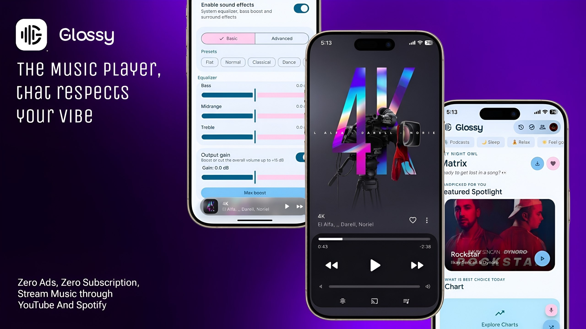

---v0.0.4
# 🚀 Glossy v0.0.4 - Animated Canvas, Equalizer & UI Overhaul

### ✨ New Features
* **Animated Canvas:** Glossy (TIDAL + Apple Music), ArchiveTune (BetterLyrics), and Spotify Canvas support.
* **Equalizer:** Tune your listening experience with built-in EQ controls.
* **Spotify Login:** Sign in directly with your Spotify account.
* **iOS-style Mini Player:** A completely refreshed mini-player experience.

### 🎨 UI & Design
* **Redesigned Screens:** Completely redesigned Home, Login, Player, Search, Settings, Lyrics, and Queue screens.
* **Material You Restyle:** Complete Material You integration with a new global `GlossyShapes` corner system for a consistent rounded design.
* **Refined Interfaces:** Improved Equalizer, Sound FX, and AutoEQ interfaces.
* **Visual Consistency:** Improved cards, chips, buttons, menus, dialogs, text fields, and visual consistency across the entire app.

### ⚡ Performance & Animations
* **Smooth Animations:** Buttery-smooth UI animations across key screens.
* **Lyrics Transitions:** Animated lyrics loading, state transitions, shimmering placeholders, and smoother lyrics ↔ thumbnail transitions.
* **Stability:** Multiple performance and stability improvements.

### 🎤 Faster Lyrics
* **Instant Loading:** Lyrics are now loaded before you even open the lyrics panel, removing the artificial 500ms lyrics delay.
* **Smart Fetching:** Lyrics begin fetching as soon as playback starts, with next-track lyrics prefetching for near-instant display when the song changes.
* **Advanced Caching:** 24-hour negative cache prevents repeatedly searching for unavailable lyrics, while retaining existing provider racing and LRU caching.

### 🛠️ And More
* **Device Fixes:** Fixed Floating navigation bar for Samsung devices (now fully working).
* **Under the Hood:** Numerous bug fixes, performance optimizations, playback improvements, and lots of smaller refinements across Glossy.

---v0.0.3
# 🚀 Glossy v0.0.3 - Ultimate Lyrics Overhaul & Fixes

### 🎤 New Lyrics Providers Stack
* **NetEase Music:** Integrated as a top-tier provider to fetch high-quality, word-by-word (YRC / Karaoke) synchronized lyrics directly without token hassles.
* **Musixmatch:** Added for high-fidelity rich-synced lyrics support.
* **SimpMusic:** Added for reliable community lyrics retrieval.
* **YouLyPlus:** Integrated for extended community lyrics coverage.
* **Unison:** Added for community-driven lyrics synchronization.
* **Megalobiz:** Integrated as a robust fallback scraper for standard LRC files.

### 🐛 Critical Bug Fixes
* **Lyrics Mismatch Bug:** Completely resolved a persistent issue where LRCLIB and KuGou were accidentally fetching and displaying lyrics of completely wrong songs.

---v0.0.2
# 🚀 Glossy v0.0.2 - Album Redesign, Crash Fixes & Automation

### ✨ UI & Design Updates
* **Immersive Album Screen:** Completely redesigned the album screen to feature a beautiful, immersive, and modern layout that perfectly complements your music.

### 🐛 Bug Fixes
* **Audio Playback:** Fixed a critical issue where the app would crash when playing certain Bhakti songs. 

### ⚙️ Under the Hood
* **Automated Security Scans:** Integrated VirusTotal into the release pipeline. Every new APK is now automatically scanned by 65+ antivirus engines, and the safe report link is attached directly to the release notes.
* **Telegram Bot Integration:** Configured an automated CI/CD workflow to instantly deploy new releases and APKs to the `@glossyplayer` Telegram support group topic.

---v0.0.1
# 🎉 Glossy v0.0.1 - Initial Release

Welcome to the very first release of **Glossy**! 🎵 
Glossy is a beautiful, highly customizable, and feature-rich open-source Android music player built with Kotlin, Jetpack Compose, and Material Design 3 Expressive. 

Here is what Glossy brings to your musical journey in this initial release:

### ✨ Stunning UI & Immersive Backgrounds
* **Dynamic Player Backgrounds:** Completely transform your player's look! Glossy fully supports **Blur (Glassmorphism)**, **Dynamic Gradients**, and gorgeous **Animated Mesh** background effects.
* **New Player Styles (Wavy & Vivi):** Introducing the gorgeous new **Wavy** player style for a fluid, modern look, alongside the nostalgic and highly requested **Vivi (Old Design)** layout. Choose the vibe that fits your music!
* **Beautiful Playlist Screen:** The playlist screen has been completely redesigned to look absolutely stunning and modern!
* **Material You & Themes:** Full support for Android's dynamic theming, pure black AMOLED mode, and custom app fonts.
* **Custom Quick Picks:** Personalize your home screen with unique thumbnail shapes like Squircle, Leaf, Ticket, Message Bubble, and more.

### 🎤 Advanced Synced Lyrics
* **Real-time Sync:** Smooth scrolling synced lyrics with support for multi-language translations.
* **Multiple Providers:** Integrated with LRCLIB, Kugou, Paxsenix, Better Lyrics, and more for the best lyrics coverage.
* **Customizable Animations:** Choose how your lyrics move with Glow, Fade, Slide, Karaoke, or Apple-style animations.

### 🎧 Playback & Social Features
* **Listen Together:** Create a room and listen to music in perfect sync with your friends (Host & Guest modes with volume sync).
* **Smart Sleep Timer:** Set a timer with options to stop after the current song or gently fade out the volume.
* **Cast Support:** Seamlessly cast your favorite tracks to compatible Google Cast devices.

### 🛠️ Extreme Customization
* **Navigation Styles:** Switch between a classic bottom bar, slim nav bar, or a modern floating navigation bar.
* **Slider Styles:** Choose between Default, Slim, Wavy, and Squiggly progress sliders.
* **Gestures:** Swipe on the mini-player or the full player thumbnail to easily skip tracks.

### ℹ️ Extras
* **Interactive About Screen:** Check out the Metrolist Devs & Special Helpers section. *(Hint: Try tapping on the developer avatars 3 times for a fun Easter egg!)*
* **Built-in Proxy Support:** Advanced settings for uninterrupted streaming.
* **Discord RPC:** Show off what you're listening to on Discord.

---
**👨‍💻 Developed with ❤️ by [Jay Chaudhary (JAY01-CYBER)](https://github.com/JAY01-CYBER)**
*Special thanks to all the contributors, helpers (Mo Agamy, Adriel O'Connel, Nyx, M4TRX), and the open-source community!*
